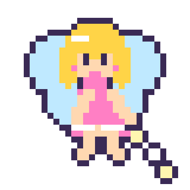
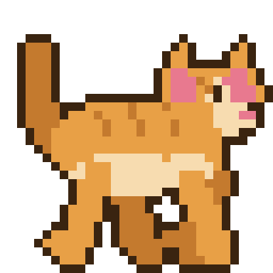
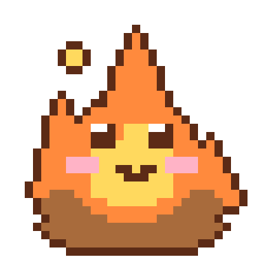
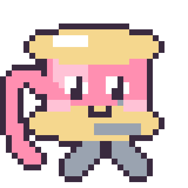
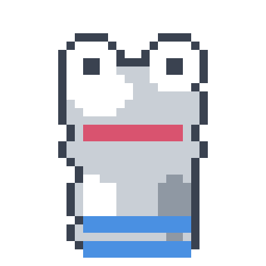
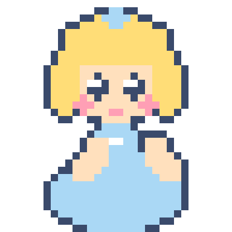
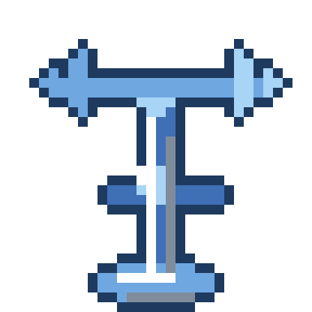

<p align="center"> <a href="https://www.python.org/"></a>   <a href=".github/workflows/deploy.yml"></a> <a href=".github/workflows/integration.yml"></a> </p>

**sprightly** is a lightweight service that generates animated pixel art GIF's from a short prompt. The service runs on Cloudflare Workers and the images are saved to Cloudflare R2.

<p align="center"></p>

## Setup

**Don't forget to enable R2** in your Cloudflare dashboard !

```sh
git clone git@github.com:nadiaenh/sprightly.git
cd sprightly
./setup.sh
```

## Usage

```sh
set -a && source .env && set +a          
python3 main.py "a walking cat"
```

## Demo

Image generation takes ~1min and costs ~$0.30 on average.

### v1

4-frame animations, one-shot only.

   

### v2

8-frame animations, up to 3 attempts using visual verification.

      

<p>"a orange dog walking" on Sep 14, 2026 by claude-opus-5 (0m42s, $0.19)</p>
<p></p>
